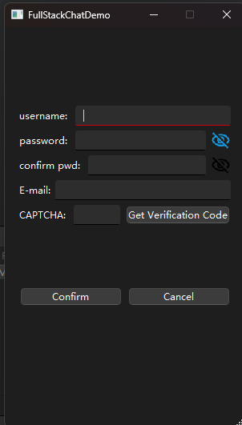
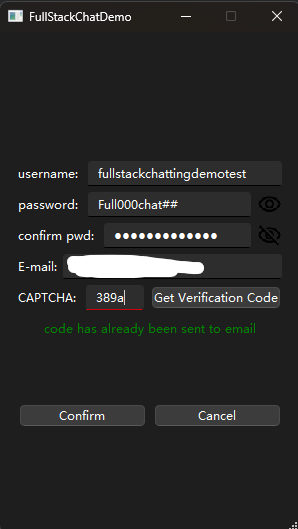
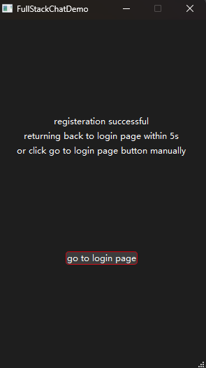
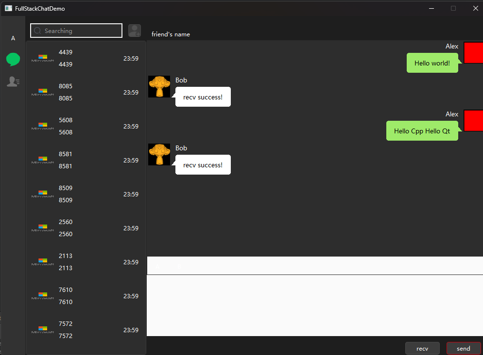
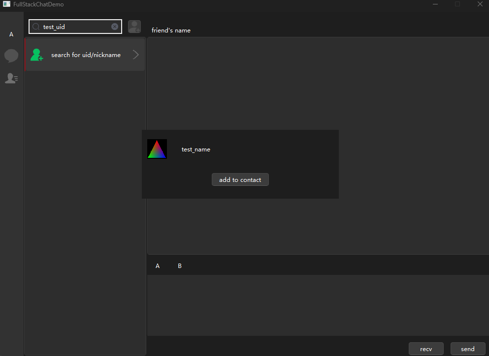
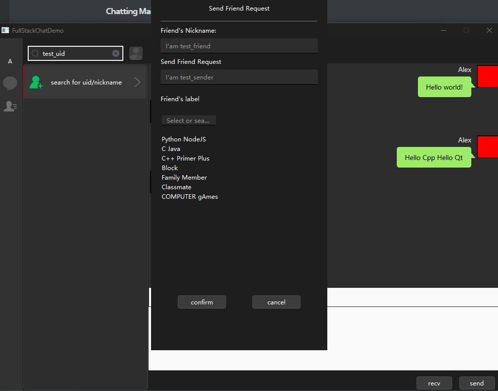
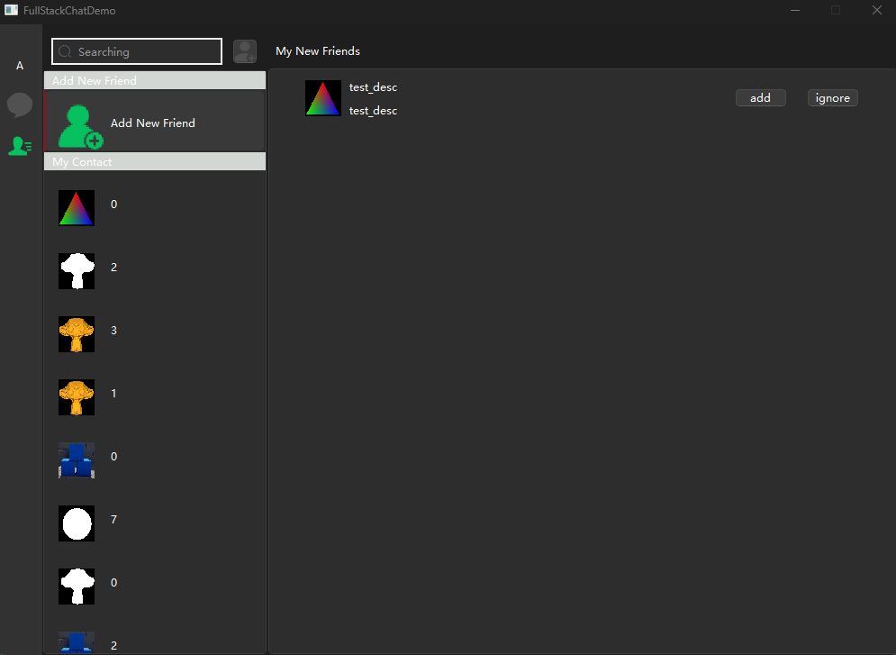

# FullStackChattingDemo
## Description

FullStackChattingDemo using C++17 standard

## Client

### Libraries

using QT6(Q::Widgets Qt::Network)

### Main page


### Register page







### Chatting Main Dialog



### Search and add new contact





### Contact Page




## **Servers**

### Libraries

**The libraries we use**

boost-1.84  (beast asio uuid mysql), grpc-1.50.2, hiredis, jsoncpp, ada(url parsing), spdlog

**For Linux/MacOS users, it's strongly recommend to install boost-1.84 in your system!!**

grpc-1.50.2 will be downloaded automatically, and we will use boringssl instead of openssl

**For Windows users, fetch content will download all of those for you**


### Server List

1. gateway-server(accept user's registration & login & forgot password requests)

   **/get_test(GET method)**: system functionality test.

   

   **/get_verification(POST method)**

   User sends get CPATCHA request to server. server using GRPC protocol to communicate with NodeJS server and generate and store uuid in Redis DB.

   **/post_registration(POST method)**

   User post registration request to server. server store info into DB.

   **/check_accountexists(POST method)**

   user post there account name and email request to server, server has to return the existance of the account

   **/reset_password(POST method)**

    after the procedure of check_accountexists, the user has to input new password and passing the password correctness checking. the request will be send to the server and store into DB.

   **/trylogin_server(POST method)**

   user pass username & password to server, and server validating those parameters in DB and allocate a chattingserver through balance-server

   ~~**/getavator(POST method)**~~

   ~~Currently not support~~

   

2. balance-server(loading balance)

3. chatting-server

4. captcha-server

   **imported libraries**

   import ioredis, grpc-js proto-loader, nodemailer, uuidv4 libraries to the project

   

   **Sending verification code to server**

   

   


​									


## Requirements

The project is self-contained almost all dependencies on both Windows and Linux/Unix-like systems.

### Main Server(C++)

main server using config.ini to store parameters

```ini
[GateServer]
port = 8080
[VerificationServer]
host=127.0.0.1
port = 65500
[MySQL]
username=root
password=123456
database=chatting
host=localhost
port=3307
timeout=60          #timeoutsetting seconds
[Redis]
host=127.0.0.1
port=16379
password=123456
[BalanceService]
host=127.0.0.1
port=8000
```

### Verification Server(Nodejs)

verification server using verification-server/config.json to store parameters

```json
{
      "email": {
                "host": "please set to your email host name",
                "port": "please set to your email port",
                "username": "please set to your email address",
                "password": "please use your own authorized code"
      },
      "mysql": {
                "host": "127.0.0.1",
                "port": 3307,
                "password": 123456
      },
      "redis": {
                "host": "127.0.0.1",
                "port": 16379,
                "password": 123456
      }
}
```

### Redis Server

1. Create a volume on host machine

   ```bash
   #if you are using windows, please download WSL2
   mkdir -p /path/to/redis/{conf,data} 
   ```

2. Download Redis configuration file

   ```bash
   vim /path/to/redis/conf/redis.conf	#write config file(you could use other editing tools!)
   ```

3. Configuration file setting

   ```ini
   # bind 192.168.1.100 10.0.0.1     # listens on two specific IPv4 addresses
   # bind 127.0.0.1 ::1              # listens on loopback IPv4 and IPv6
   # bind * -::*                     # like the default, all available interfaces
   # bind 127.0.0.1 -::1
   
   # By default protected mode is enabled. You should disable it only if
   # you are sure you want clients from other hosts to connect to Redis
   # even if no authentication is configured.
   protected-mode no
   
   # Accept connections on the specified port, default is 6379 (IANA #815344).
   # If port 0 is specified Redis will not listen on a TCP socket.
   port 6379
   
   # TCP listen() backlog.
   tcp-backlog 511
   
   # Close the connection after a client is idle for N seconds (0 to disable)
   timeout 0
   
   # TCP keepalive.
   # If non-zero, use SO_KEEPALIVE to send TCP ACKs to clients in absence
   # of communication. This is useful for two reasons:
   # 1) Detect dead peers.
   # 2) Force network equipment in the middle to consider the connection to be
   #    alive.
   tcp-keepalive 300
   
   ################################# GENERAL #####################################
   # By default Redis does not run as a daemon. Use 'yes' if you need it.
   # Note that Redis will write a pid file in /var/run/redis.pid when daemonized.
   # When Redis is supervised by upstart or systemd, this parameter has no impact.
   daemonize no
   pidfile /var/run/redis_6379.pid
   loglevel notice
   logfile ""
   
   # Set the number of databases. The default database is DB 0, you can select
   # a different one on a per-connection basis using SELECT <dbid> where
   # dbid is a number between 0 and 'databases'-1
   databases 16
   
   always-show-logo no
   set-proc-title yes
   
   # When changing the process title, Redis uses the following template to construct
   # the modified title.
   # Template variables are specified in curly brackets. The following variables are
   # supported:
   # {title}           Name of process as executed if parent, or type of child process.
   # {listen-addr}     Bind address or '*' followed by TCP or TLS port listening on, or
   #                   Unix socket if only that's available.
   # {server-mode}     Special mode, i.e. "[sentinel]" or "[cluster]".
   # {port}            TCP port listening on, or 0.
   # {tls-port}        TLS port listening on, or 0.
   # {unixsocket}      Unix domain socket listening on, or "".
   # {config-file}     Name of configuration file used.
   proc-title-template "{title} {listen-addr} {server-mode}"
   locale-collate ""
   stop-writes-on-bgsave-error yes
   rdbcompression yes
   rdbchecksum yes
   
   # The filename where to dump the DB
   dbfilename dump.rdb
   rdb-del-sync-files no
   dir ./
   
   ################################# REPLICATION #################################
   # If the master is password protected (using the "requirepass" configuration
   # directive below) it is possible to tell the replica to authenticate before
   # starting the replication synchronization process, otherwise the master will
   # refuse the replica request.
   #
   # masterauth <master-password>
   #
   # However this is not enough if you are using Redis ACLs (for Redis version
   # 6 or greater), and the default user is not capable of running the PSYNC
   # command and/or other commands needed for replication. In this case it's
   # better to configure a special user to use with replication, and specify the
   # masteruser configuration as such:
   #
   # masteruser <username>
   #
   # When masteruser is specified, the replica will authenticate against its
   # master using the new AUTH form: AUTH <username> <password>.
   requirepass 123456
   
   
   replica-serve-stale-data yes
   replica-read-only yes
   repl-diskless-sync yes
   repl-diskless-sync-delay 5
   repl-diskless-sync-max-replicas 0
   repl-diskless-load disabled
   repl-disable-tcp-nodelay no
   replica-priority 100
   acllog-max-len 128
   lazyfree-lazy-eviction no
   lazyfree-lazy-expire no
   lazyfree-lazy-server-del no
   replica-lazy-flush no
   lazyfree-lazy-user-del no
   lazyfree-lazy-user-flush no
   oom-score-adj no
   oom-score-adj-values 0 200 800
   disable-thp yes
   appendonly no
   appendfilename "appendonly.aof"
   appenddirname "appendonlydir"
   
   # The fsync() call tells the Operating System to actually write data on disk
   # instead of waiting for more data in the output buffer. Some OS will really flush
   # data on disk, some other OS will just try to do it ASAP.
   #
   # Redis supports three different modes:
   #
   # no: don't fsync, just let the OS flush the data when it wants. Faster.
   # always: fsync after every write to the append only log. Slow, Safest.
   # everysec: fsync only one time every second. Compromise.
   #
   # The default is "everysec", as that's usually the right compromise between
   # speed and data safety. It's up to you to understand if you can relax this to
   # "no" that will let the operating system flush the output buffer when
   # it wants, for better performances (but if you can live with the idea of
   # some data loss consider the default persistence mode that's snapshotting),
   # or on the contrary, use "always" that's very slow but a bit safer than
   # everysec.
   #
   # More details please check the following article:
   # http://antirez.com/post/redis-persistence-demystified.html
   #
   # If unsure, use "everysec".
   # appendfsync always
   appendfsync everysec
   # appendfsync no
   
   no-appendfsync-on-rewrite no
   auto-aof-rewrite-percentage 100
   auto-aof-rewrite-min-size 64mb
   aof-load-truncated yes
   aof-use-rdb-preamble yes
   aof-timestamp-enabled no
   slowlog-log-slower-than 10000
   slowlog-max-len 128
   latency-monitor-threshold 0
   notify-keyspace-events ""
   hash-max-listpack-entries 512
   hash-max-listpack-value 64
   list-max-listpack-size -2
   list-compress-depth 0
   set-max-intset-entries 512
   set-max-listpack-entries 128
   set-max-listpack-value 64
   zset-max-listpack-entries 128
   zset-max-listpack-value 64
   hll-sparse-max-bytes 3000
   stream-node-max-bytes 4096
   stream-node-max-entries 100
   activerehashing yes
   client-output-buffer-limit normal 0 0 0
   client-output-buffer-limit replica 256mb 64mb 60
   client-output-buffer-limit pubsub 32mb 8mb 60
   hz 10
   dynamic-hz yes
   aof-rewrite-incremental-fsync yes
   rdb-save-incremental-fsync yes
   jemalloc-bg-thread yes
   
4. Create Redis container

   ```bash
   #Pull the official docker image from Docker hub
   	docker pull redis:7.2.4
   	
   #create container
   docker run \
   --restart always \
   -p 16379:6379 --name redis \
   --privileged=true \
   -v /path/to/redis/conf/redis.conf:/etc/redis/redis.conf \
   -v /path/to/redis/data:/data:rw \
   -d redis:7.2.4 redis-server /etc/redis/redis.conf \
   --appendonly yes
   ```

5. Entering Redis container

   ```bash
   #entering redis
   	docker exec -it redis bash
   	
   # login redis db
   	redis-cli
   ```


### MySQL Server

1. Create a volume on host machine

   ```bash
   #if you are using windows, please download WSL2
   mkdir -p /path/to/mysql/{conf,data} 
   ```

2. Create a configuration file(my.cnf)

   ```bash
   touch /path/to/mysql/conf/my.cnf	#create
   vim /path/to/mysql/conf/my.cnf		#write config file(you could use other editing tools!)
   ```

3. Configuration file setting

   ```ini
   [mysqld]
   default-authentication-plugin=mysql_native_password
   skip-host-cache
   skip-name-resolve
   datadir=/var/lib/mysql
   socket=/var/run/mysqld/mysqld.sock
   secure-file-priv=/var/lib/mysql-files
   user=mysql
   character-set-server=utf8
   max_connections=200
   max_connect_errors=10
   pid-file=/var/run/mysqld/mysqld.pid
   [client]
   socket=/var/run/mysqld/mysqld.sock
   default-character-set=utf8
   !includedir /etc/mysql/conf.d/
   ```
   
4. Create MySQL container

   **If you intended to pass a host directory, please use absolute path.**

   ```bash
   #Pull the official docker image from Docker hub
   	docker pull mysql:8.0
   	
   #Start a mysql server instance
   	 docker run --restart=on-failure:3 -d \
   	-v /path/to/mysql/conf:/etc/mysql/conf.d \
       -v /path/to/mysql/data:/var/lib/mysql \
   	-e MYSQL_ROOT_PASSWORD="your_password" \
   	-p 3307:3306 --name "your_container_name" \
       mysql:8.0
   ```

5. Entering mysql and login DB

   ```bash
   #entering mysql
   	docker exec -it "your_container_name" bash
   	
   # login mysql db ( -u: root by default, -p password)
   	mysql -uroot -p"your_password" 
   ```


6. **DataBase Has to be created, before starting the main server!!!**

   You could choose DataBase tools to create database and table
   
   ```sql
   #database's name should match config.ini database name!
   CREATE DATABASE chatting;
   
   CREATE TABLE chatting.user_info(
   	username varchar(255) not null,
   	password varchar(255) not null,
       uid integer not null,
       email varchar(255) not null
   );
   
   CREATE TABLE chatting.uid_gen(
       uid integer not null
   );
   
   INSERT INTO chatting.uid_gen(uid) VALUE(0);
   ```


## Developer Quick Start

### Platform Support
Windows, Linux, MacOS(Intel & Apple Silicon M)

### Download FullStackChattingDemo

```bash
git clone https://github.com/Liupeter01/FullStackChattingDemo
```

### Compile Client

1. For Windows

   ```bash
   #please import client dir to qt creator
   ```

2. For MacOS/Linux

   ```bash
   #It might take a long time to download dependency libraies!!!!
   cd FullStackChattingDemo/client
   cmake -Bbuild -DCMAKE_BUILD_TYPE=Release
   cmake --build build --parallel [x]
   ```

### Compile GatewayServer/BalanceServer/Chattingserver

1. For Linux/Windows

   ```bash
   cd FullStackChattingDemo/server
   git submodule update --init
   cmake -Bbuild -DCMAKE_BUILD_TYPE=Release
   cmake --build build --parallel [x]
   ```

2. For MacOS

   ```bash
   cd FullStackChattingDemo/server
   git submodule update --init
   cmake -Bbuild -DCMAKE_BUILD_TYPE=Release -DCMAKE_INCLUDE_PATH=/usr/local/include
   cmake --build build --parallel [x]
   ```


### How to Execute

1. Activate Redis and MySQL service

   **IMPORTANT: you have to start those services first!!**

   

2. Execute Servers' program

   ```bash
   ./balance-server/build/BalanceServer
   ./gateway-server/build/GatewayServer
   ./chatting-server/build/ChattingServer
   ```

3. Execute captcha-server(Nodejs)

   ```bash
   cd captcha-server
   npm install
   node index.js  # you could use nodemon
   ```

4. Execute Client

   ```bash
   ./client/build/ChattingClient
   ```


### Error Handling

1. SyntaxError: Unexpected token  in JSON at position 0
   ```bash
   SyntaxError: Unexpected token  in JSON at position 0
       at JSON.parse (<anonymous>)
   ```

   Solving
   please change your encoding method to UTF-8, especially for VSCode user

   Referring Url
   https://stackoverflow.com/questions/55960919/nodejs-syntaxerror-unexpected-token-in-json-at-position-0

   

2. undefined symbol upb_alloc_global
   ```cmake
   set(protobuf_BUILD_LIBUPB OFF)
   ```

   Referring Url
   https://github.com/grpc/grpc/issues/35794

   

3. fatal error: 'unicode/locid.h' 'unicode/ucnv.h' file not found (usually happened on MacOS)
   Download icu 74.1
   ```bash
   wget https://github.com/unicode-org/icu/releases/download/release-74-1/icu4c-74_1-src.tgz
   ```

   Compile and Install
   ```bash
   git clone https://github.com/unicode-org/icu.git
   cd icu/source
   ./configure && make -j[x]
   sudo make install
   ```

   set cmake variable
   ```cmake
   cmake -Bbuild -DCMAKE_INCLUDE_PATH=/usr/local/include
   cmake --build build --parallel x
   ```

   Referring Url
   https://unicode-org.github.io/icu/userguide/icu4c/build.html

   

4. boringssl undefined win32
   ```cmake
   set(OPENSSL_NO_ASM ON)
   ```

   Referring Url
   https://github.com/grpc/grpc/issues/16376

   

5. Handling gRPC issue
   Issue description

   ```bash
   CMake Error: install(EXPORT "protobuf-targets" ...) includes target "libprotobuf-lite" which requires target "absl_node_hash_map" that is not in any export set.
   ```

   Problem Solving
   ```cmake
   set(ABSL_ENABLE_INSTALL ON)
   ```

   Referring Url
    https://github.com/protocolbuffers/protobuf/issues/12185
    https://github.com/protocolbuffers/protobuf/issues/12185#issuecomment-1594685860

   

6. E No address added out of total 1 resolved

   you have to start the main server first and then open nodejs service

   
