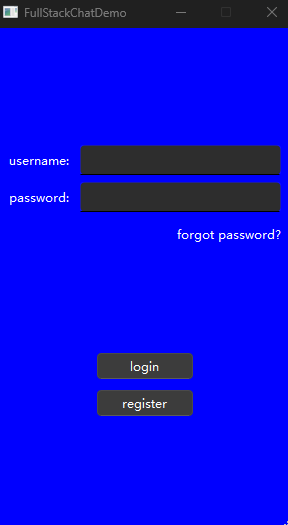
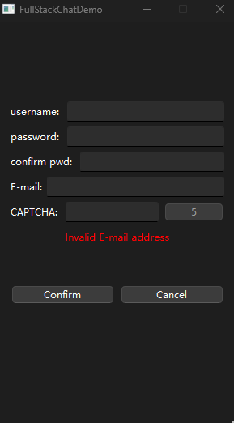
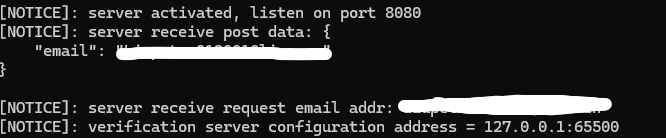
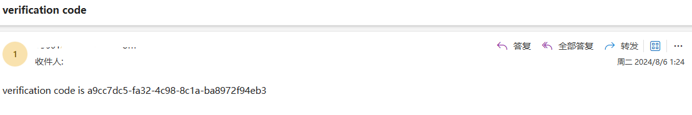

# FullStackChattingDemo
## Description

FullStackChattingDemo using C++17 standard

## Client

### Libraries

using QT6(Q::Widgets Qt::Network)





## Server

### Libraries

boost-1.84  (beast asio uuid mysql), grpc-1.50.2, hiredis, jsoncpp, ada(url parsing), spdlog

### Functions

/get_test(GET method): system function test.

/get_verification(POST method): User sends get CPATCHA request to server. server using GRPC protocol to communicate with NodeJS server and generate and store uuid in Redis DB.

/post_registration(POST method): User post registration request to server. server store info into DB.



### Submodule -- Verification Server(NodeJS)

import ioredis, grpc-js proto-loader, nodemailer, uuidv4 libraries to the project

Sending verification code to server


 


## Requirements

The project is self-contained almost all dependencies on both Windows and Linux/Unix-like systems.

### Main Server(C++)

main server using config.ini to store parameters

```ini
[GateServer]
port = 8080
[VerificationServer]
host=127.0.0.1
port = 65500
[MySQL]
username=root
password=123456
database=chatting
host=localhost
port=3307
timeout=60          #timeoutsetting seconds
[Redis]
host=127.0.0.1
port=6379
password=123456
```

### Verification Server(Nodejs)

verification server using verification-server/config.json to store parameters

```json
{
      "email": {
                "host": "please set to your email host name",
                "port": "please set to your email port",
                "username": "please set to your email address",
                "password": "please use your own authorized code"
      },
      "mysql": {
                "host": "127.0.0.1",
                "port": 3307,
                "password": 123456
      },
      "redis": {
                "host": "127.0.0.1",
                "port": 16379,
                "password": 123456
      }
}
```

### Redis Server

1. Create a volume on host machine

   ```bash
   #if you are using windows, please download WSL2
   mkdir -p /path/to/redis/{conf,data} 
   ```

2. Download Redis configuration file

   ```bash
   #download redis.conf
   cd /path/to/redis/conf
   vim /path/to/redis/conf/redis.conf	#write config file(you could use other editing tools!)
   ```

3. Configuration file setting

   ```ini
   # ./redis-server /path/to/redis.conf
   
   ################################## NETWORK #####################################
   # By default, if no "bind" configuration directive is specified, Redis listens
   # for connections from all available network interfaces on the host machine.
   # It is possible to listen to just one or multiple selected interfaces using
   # the "bind" configuration directive, followed by one or more IP addresses.
   # Each address can be prefixed by "-", which means that redis will not fail to
   # start if the address is not available. Being not available only refers to
   # addresses that does not correspond to any network interface. Addresses that
   # are already in use will always fail, and unsupported protocols will always BE
   # silently skipped.
   # bind 192.168.1.100 10.0.0.1     # listens on two specific IPv4 addresses
   # bind 127.0.0.1 ::1              # listens on loopback IPv4 and IPv6
   # bind * -::*                     # like the default, all available interfaces
   #
   # ~~~ WARNING ~~~ If the computer running Redis is directly exposed to the
   # internet, binding to all the interfaces is dangerous and will expose the
   # instance to everybody on the internet. So by default we uncomment the
   # following bind directive, that will force Redis to listen only on the
   # IPv4 and IPv6 (if available) loopback interface addresses (this means Redis
   # will only be able to accept client connections from the same host that it is
   # running on).
   #
   # IF YOU ARE SURE YOU WANT YOUR INSTANCE TO LISTEN TO ALL THE INTERFACES
   # COMMENT OUT THE FOLLOWING LINE.
   #
   # You will also need to set a password unless you explicitly disable protected
   # mode.
   # ~~~~~~~~~~~~~~~~~~~~~~~~~~~~~~~~~~~~~~~~~~~~~~~~~~~~~~~~~~~~~~~~~~~~~~~~
   # bind 127.0.0.1 -::1
   
   # By default, outgoing connections (from replica to master, from Sentinel to
   # instances, cluster bus, etc.) are not bound to a specific local address. In
   # most cases, this means the operating system will handle that based on routing
   # and the interface through which the connection goes out.
   # Using bind-source-addr it is possible to configure a specific address to bind
   # to, which may also affect how the connection gets routed.
   # bind-source-addr 10.0.0.1
   
   # Protected mode is a layer of security protection, in order to avoid that
   # Redis instances left open on the internet are accessed and exploited.
   #
   # When protected mode is on and the default user has no password, the server
   # only accepts local connections from the IPv4 address (127.0.0.1), IPv6 address
   # (::1) or Unix domain sockets.
   #
   # By default protected mode is enabled. You should disable it only if
   # you are sure you want clients from other hosts to connect to Redis
   # even if no authentication is configured.
   protected-mode no
   
   # Accept connections on the specified port, default is 6379 (IANA #815344).
   # If port 0 is specified Redis will not listen on a TCP socket.
   port 6379
   
   # TCP listen() backlog.
   # In high requests-per-second environments you need a high backlog in order
   # to avoid slow clients connection issues. Note that the Linux kernel
   # will silently truncate it to the value of /proc/sys/net/core/somaxconn so
   # make sure to raise both the value of somaxconn and tcp_max_syn_backlog
   # in order to get the desired effect.
   tcp-backlog 511
   
   # Close the connection after a client is idle for N seconds (0 to disable)
   timeout 0
   
   # TCP keepalive.
   # If non-zero, use SO_KEEPALIVE to send TCP ACKs to clients in absence
   # of communication. This is useful for two reasons:
   # 1) Detect dead peers.
   # 2) Force network equipment in the middle to consider the connection to be
   #    alive.
   # On Linux, the specified value (in seconds) is the period used to send ACKs.
   # Note that to close the connection the double of the time is needed.
   # On other kernels the period depends on the kernel configuration.
   # A reasonable value for this option is 300 seconds, which is the new
   # Redis default starting with Redis 3.2.1.
   tcp-keepalive 300
   
   ################################# GENERAL #####################################
   # By default Redis does not run as a daemon. Use 'yes' if you need it.
   # Note that Redis will write a pid file in /var/run/redis.pid when daemonized.
   # When Redis is supervised by upstart or systemd, this parameter has no impact.
   daemonize no
   
   # If a pid file is specified, Redis writes it where specified at startup
   # and removes it at exit.
   # When the server runs non daemonized, no pid file is created if none is
   # specified in the configuration. When the server is daemonized, the pid file
   # is used even if not specified, defaulting to "/var/run/redis.pid".
   # Creating a pid file is best effort: if Redis is not able to create it
   # nothing bad happens, the server will start and run normally.
   # Note that on modern Linux systems "/run/redis.pid" is more conforming
   # and should be used instead.
   pidfile /var/run/redis_6379.pid
   
   # Specify the server verbosity level.
   # This can be one of:
   # debug (a lot of information, useful for development/testing)
   # verbose (many rarely useful info, but not a mess like the debug level)
   # notice (moderately verbose, what you want in production probably)
   # warning (only very important / critical messages are logged)
   # nothing (nothing is logged)
   loglevel notice
   
   # Specify the log file name. Also the empty string can be used to force
   # Redis to log on the standard output. Note that if you use standard
   # output for logging but daemonize, logs will be sent to /dev/null
   logfile ""
   
   # Set the number of databases. The default database is DB 0, you can select
   # a different one on a per-connection basis using SELECT <dbid> where
   # dbid is a number between 0 and 'databases'-1
   databases 16
   
   # By default Redis shows an ASCII art logo only when started to log to the
   # standard output and if the standard output is a TTY and syslog logging is
   # disabled. Basically this means that normally a logo is displayed only in
   # interactive sessions.
   # However it is possible to force the pre-4.0 behavior and always show a
   # ASCII art logo in startup logs by setting the following option to yes.
   always-show-logo no
   
   # By default, Redis modifies the process title (as seen in 'top' and 'ps') to
   # provide some runtime information. It is possible to disable this and leave
   # the process name as executed by setting the following to no.
   set-proc-title yes
   
   # When changing the process title, Redis uses the following template to construct
   # the modified title.
   # Template variables are specified in curly brackets. The following variables are
   # supported:
   # {title}           Name of process as executed if parent, or type of child process.
   # {listen-addr}     Bind address or '*' followed by TCP or TLS port listening on, or
   #                   Unix socket if only that's available.
   # {server-mode}     Special mode, i.e. "[sentinel]" or "[cluster]".
   # {port}            TCP port listening on, or 0.
   # {tls-port}        TLS port listening on, or 0.
   # {unixsocket}      Unix domain socket listening on, or "".
   # {config-file}     Name of configuration file used.
   proc-title-template "{title} {listen-addr} {server-mode}"
   
   # Set the local environment which is used for string comparison operations, and 
   # also affect the performance of Lua scripts. Empty String indicates the locale 
   # is derived from the environment variables.
   locale-collate ""
   
   ################################ SNAPSHOTTING  ################################
   # By default Redis will stop accepting writes if RDB snapshots are enabled
   # (at least one save point) and the latest background save failed.
   # This will make the user aware (in a hard way) that data is not persisting
   # on disk properly, otherwise chances are that no one will notice and some
   # disaster will happen.
   # If the background saving process will start working again Redis will
   # automatically allow writes again.
   # However if you have setup your proper monitoring of the Redis server
   # and persistence, you may want to disable this feature so that Redis will
   # continue to work as usual even if there are problems with disk,
   # permissions, and so forth.
   stop-writes-on-bgsave-error yes
   
   # Compress string objects using LZF when dump .rdb databases?
   # By default compression is enabled as it's almost always a win.
   # If you want to save some CPU in the saving child set it to 'no' but
   # the dataset will likely be bigger if you have compressible values or keys.
   rdbcompression yes
   
   # Since version 5 of RDB a CRC64 checksum is placed at the end of the file.
   # This makes the format more resistant to corruption but there is a performance
   # hit to pay (around 10%) when saving and loading RDB files, so you can disable it
   # for maximum performances.
   #
   # RDB files created with checksum disabled have a checksum of zero that will
   # tell the loading code to skip the check.
   rdbchecksum yes
   
   # The filename where to dump the DB
   dbfilename dump.rdb
   
   # Remove RDB files used by replication in instances without persistence
   # enabled. By default this option is disabled, however there are environments
   # where for regulations or other security concerns, RDB files persisted on
   # disk by masters in order to feed replicas, or stored on disk by replicas
   # in order to load them for the initial synchronization, should be deleted
   # ASAP. Note that this option ONLY WORKS in instances that have both AOF
   # and RDB persistence disabled, otherwise is completely ignored.
   #
   # An alternative (and sometimes better) way to obtain the same effect is
   # to use diskless replication on both master and replicas instances. However
   # in the case of replicas, diskless is not always an option.
   rdb-del-sync-files no
   
   # The working directory.
   #
   # The DB will be written inside this directory, with the filename specified
   # above using the 'dbfilename' configuration directive.
   #
   # The Append Only File will also be created inside this directory.
   #
   # Note that you must specify a directory here, not a file name.
   dir ./
   
   ################################# REPLICATION #################################
   # If the master is password protected (using the "requirepass" configuration
   # directive below) it is possible to tell the replica to authenticate before
   # starting the replication synchronization process, otherwise the master will
   # refuse the replica request.
   #
   # masterauth <master-password>
   #
   # However this is not enough if you are using Redis ACLs (for Redis version
   # 6 or greater), and the default user is not capable of running the PSYNC
   # command and/or other commands needed for replication. In this case it's
   # better to configure a special user to use with replication, and specify the
   # masteruser configuration as such:
   #
   # masteruser <username>
   #
   # When masteruser is specified, the replica will authenticate against its
   # master using the new AUTH form: AUTH <username> <password>.
   requirepass 123456
   
   # When a replica loses its connection with the master, or when the replication
   # is still in progress, the replica can act in two different ways:
   #
   # 1) if replica-serve-stale-data is set to 'yes' (the default) the replica will
   #    still reply to client requests, possibly with out of date data, or the
   #    data set may just be empty if this is the first synchronization.
   #
   # 2) If replica-serve-stale-data is set to 'no' the replica will reply with error
   #    "MASTERDOWN Link with MASTER is down and replica-serve-stale-data is set to 'no'"
   #    to all data access commands, excluding commands such as:
   #    INFO, REPLICAOF, AUTH, SHUTDOWN, REPLCONF, ROLE, CONFIG, SUBSCRIBE,
   #    UNSUBSCRIBE, PSUBSCRIBE, PUNSUBSCRIBE, PUBLISH, PUBSUB, COMMAND, POST,
   #    HOST and LATENCY.
   #
   replica-serve-stale-data yes
   
   # You can configure a replica instance to accept writes or not. Writing against
   # a replica instance may be useful to store some ephemeral data (because data
   # written on a replica will be easily deleted after resync with the master) but
   # may also cause problems if clients are writing to it because of a
   # misconfiguration.
   #
   # Since Redis 2.6 by default replicas are read-only.
   #
   # Note: read only replicas are not designed to be exposed to untrusted clients
   # on the internet. It's just a protection layer against misuse of the instance.
   # Still a read only replica exports by default all the administrative commands
   # such as CONFIG, DEBUG, and so forth. To a limited extent you can improve
   # security of read only replicas using 'rename-command' to shadow all the
   # administrative / dangerous commands.
   replica-read-only yes
   
   # Replication SYNC strategy: disk or socket.
   #
   # New replicas and reconnecting replicas that are not able to continue the
   # replication process just receiving differences, need to do what is called a
   # "full synchronization". An RDB file is transmitted from the master to the
   # replicas.
   #
   # The transmission can happen in two different ways:
   #
   # 1) Disk-backed: The Redis master creates a new process that writes the RDB
   #                 file on disk. Later the file is transferred by the parent
   #                 process to the replicas incrementally.
   # 2) Diskless: The Redis master creates a new process that directly writes the
   #              RDB file to replica sockets, without touching the disk at all.
   #
   # With disk-backed replication, while the RDB file is generated, more replicas
   # can be queued and served with the RDB file as soon as the current child
   # producing the RDB file finishes its work. With diskless replication instead
   # once the transfer starts, new replicas arriving will be queued and a new
   # transfer will start when the current one terminates.
   #
   # When diskless replication is used, the master waits a configurable amount of
   # time (in seconds) before starting the transfer in the hope that multiple
   # replicas will arrive and the transfer can be parallelized.
   #
   # With slow disks and fast (large bandwidth) networks, diskless replication
   # works better.
   repl-diskless-sync yes
   
   # When diskless replication is enabled, it is possible to configure the delay
   # the server waits in order to spawn the child that transfers the RDB via socket
   # to the replicas.
   #
   # This is important since once the transfer starts, it is not possible to serve
   # new replicas arriving, that will be queued for the next RDB transfer, so the
   # server waits a delay in order to let more replicas arrive.
   #
   # The delay is specified in seconds, and by default is 5 seconds. To disable
   # it entirely just set it to 0 seconds and the transfer will start ASAP.
   repl-diskless-sync-delay 5
   
   # When diskless replication is enabled with a delay, it is possible to let
   # the replication start before the maximum delay is reached if the maximum
   # number of replicas expected have connected. Default of 0 means that the
   # maximum is not defined and Redis will wait the full delay.
   repl-diskless-sync-max-replicas 0
   
   # -----------------------------------------------------------------------------
   # WARNING: Since in this setup the replica does not immediately store an RDB on
   # disk, it may cause data loss during failovers. RDB diskless load + Redis
   # modules not handling I/O reads may cause Redis to abort in case of I/O errors
   # during the initial synchronization stage with the master.
   # -----------------------------------------------------------------------------
   #
   # Replica can load the RDB it reads from the replication link directly from the
   # socket, or store the RDB to a file and read that file after it was completely
   # received from the master.
   #
   # In many cases the disk is slower than the network, and storing and loading
   # the RDB file may increase replication time (and even increase the master's
   # Copy on Write memory and replica buffers).
   # However, when parsing the RDB file directly from the socket, in order to avoid
   # data loss it's only safe to flush the current dataset when the new dataset is
   # fully loaded in memory, resulting in higher memory usage.
   # For this reason we have the following options:
   #
   # "disabled"    - Don't use diskless load (store the rdb file to the disk first)
   # "swapdb"      - Keep current db contents in RAM while parsing the data directly
   #                 from the socket. Replicas in this mode can keep serving current
   #                 dataset while replication is in progress, except for cases where
   #                 they can't recognize master as having a data set from same
   #                 replication history.
   #                 Note that this requires sufficient memory, if you don't have it,
   #                 you risk an OOM kill.
   # "on-empty-db" - Use diskless load only when current dataset is empty. This is 
   #                 safer and avoid having old and new dataset loaded side by side
   #                 during replication.
   repl-diskless-load disabled
   
   # Disable TCP_NODELAY on the replica socket after SYNC?
   #
   # If you select "yes" Redis will use a smaller number of TCP packets and
   # less bandwidth to send data to replicas. But this can add a delay for
   # the data to appear on the replica side, up to 40 milliseconds with
   # Linux kernels using a default configuration.
   #
   # If you select "no" the delay for data to appear on the replica side will
   # be reduced but more bandwidth will be used for replication.
   #
   # By default we optimize for low latency, but in very high traffic conditions
   # or when the master and replicas are many hops away, turning this to "yes" may
   # be a good idea.
   repl-disable-tcp-nodelay no
   
   # The replica priority is an integer number published by Redis in the INFO
   # output. It is used by Redis Sentinel in order to select a replica to promote
   # into a master if the master is no longer working correctly.
   #
   # A replica with a low priority number is considered better for promotion, so
   # for instance if there are three replicas with priority 10, 100, 25 Sentinel
   # will pick the one with priority 10, that is the lowest.
   #
   # However a special priority of 0 marks the replica as not able to perform the
   # role of master, so a replica with priority of 0 will never be selected by
   # Redis Sentinel for promotion.
   #
   # By default the priority is 100.
   replica-priority 100
   
   # ACL LOG
   #
   # The ACL Log tracks failed commands and authentication events associated
   # with ACLs. The ACL Log is useful to troubleshoot failed commands blocked
   # by ACLs. The ACL Log is stored in memory. You can reclaim memory with
   # ACL LOG RESET. Define the maximum entry length of the ACL Log below.
   acllog-max-len 128
   
   ############################# LAZY FREEING ####################################
   # Redis has two primitives to delete keys. One is called DEL and is a blocking
   # deletion of the object. It means that the server stops processing new commands
   # in order to reclaim all the memory associated with an object in a synchronous
   # way. If the key deleted is associated with a small object, the time needed
   # in order to execute the DEL command is very small and comparable to most other
   # O(1) or O(log_N) commands in Redis. However if the key is associated with an
   # aggregated value containing millions of elements, the server can block for
   # a long time (even seconds) in order to complete the operation.
   #
   # For the above reasons Redis also offers non blocking deletion primitives
   # such as UNLINK (non blocking DEL) and the ASYNC option of FLUSHALL and
   # FLUSHDB commands, in order to reclaim memory in background. Those commands
   # are executed in constant time. Another thread will incrementally free the
   # object in the background as fast as possible.
   #
   # DEL, UNLINK and ASYNC option of FLUSHALL and FLUSHDB are user-controlled.
   # It's up to the design of the application to understand when it is a good
   # idea to use one or the other. However the Redis server sometimes has to
   # delete keys or flush the whole database as a side effect of other operations.
   # Specifically Redis deletes objects independently of a user call in the
   # following scenarios:
   #
   # 1) On eviction, because of the maxmemory and maxmemory policy configurations,
   #    in order to make room for new data, without going over the specified
   #    memory limit.
   # 2) Because of expire: when a key with an associated time to live (see the
   #    EXPIRE command) must be deleted from memory.
   # 3) Because of a side effect of a command that stores data on a key that may
   #    already exist. For example the RENAME command may delete the old key
   #    content when it is replaced with another one. Similarly SUNIONSTORE
   #    or SORT with STORE option may delete existing keys. The SET command
   #    itself removes any old content of the specified key in order to replace
   #    it with the specified string.
   # 4) During replication, when a replica performs a full resynchronization with
   #    its master, the content of the whole database is removed in order to
   #    load the RDB file just transferred.
   #
   # In all the above cases the default is to delete objects in a blocking way,
   # like if DEL was called. However you can configure each case specifically
   # in order to instead release memory in a non-blocking way like if UNLINK
   # was called, using the following configuration directives.
   lazyfree-lazy-eviction no
   lazyfree-lazy-expire no
   lazyfree-lazy-server-del no
   replica-lazy-flush no
   
   # It is also possible, for the case when to replace the user code DEL calls
   # with UNLINK calls is not easy, to modify the default behavior of the DEL
   # command to act exactly like UNLINK, using the following configuration
   # directive:
   lazyfree-lazy-user-del no
   
   # FLUSHDB, FLUSHALL, SCRIPT FLUSH and FUNCTION FLUSH support both asynchronous and synchronous
   # deletion, which can be controlled by passing the [SYNC|ASYNC] flags into the
   # commands. When neither flag is passed, this directive will be used to determine
   # if the data should be deleted asynchronously.
   lazyfree-lazy-user-flush no
   
   ############################ KERNEL OOM CONTROL ##############################
   # On Linux, it is possible to hint the kernel OOM killer on what processes
   # should be killed first when out of memory.
   #
   # Enabling this feature makes Redis actively control the oom_score_adj value
   # for all its processes, depending on their role. The default scores will
   # attempt to have background child processes killed before all others, and
   # replicas killed before masters.
   #
   # Redis supports these options:
   #
   # no:       Don't make changes to oom-score-adj (default).
   # yes:      Alias to "relative" see below.
   # absolute: Values in oom-score-adj-values are written as is to the kernel.
   # relative: Values are used relative to the initial value of oom_score_adj when
   #           the server starts and are then clamped to a range of -1000 to 1000.
   #           Because typically the initial value is 0, they will often match the
   #           absolute values.
   oom-score-adj no
   
   # When oom-score-adj is used, this directive controls the specific values used
   # for master, replica and background child processes. Values range -2000 to
   # 2000 (higher means more likely to be killed).
   #
   # Unprivileged processes (not root, and without CAP_SYS_RESOURCE capabilities)
   # can freely increase their value, but not decrease it below its initial
   # settings. This means that setting oom-score-adj to "relative" and setting the
   # oom-score-adj-values to positive values will always succeed.
   oom-score-adj-values 0 200 800
   
   #################### KERNEL transparent hugepage CONTROL ######################
   # Usually the kernel Transparent Huge Pages control is set to "madvise" or
   # or "never" by default (/sys/kernel/mm/transparent_hugepage/enabled), in which
   # case this config has no effect. On systems in which it is set to "always",
   # redis will attempt to disable it specifically for the redis process in order
   # to avoid latency problems specifically with fork(2) and CoW.
   # If for some reason you prefer to keep it enabled, you can set this config to
   # "no" and the kernel global to "always".
   disable-thp yes
   
   ############################## APPEND ONLY MODE ###############################
   # By default Redis asynchronously dumps the dataset on disk. This mode is
   # good enough in many applications, but an issue with the Redis process or
   # a power outage may result into a few minutes of writes lost (depending on
   # the configured save points).
   #
   # The Append Only File is an alternative persistence mode that provides
   # much better durability. For instance using the default data fsync policy
   # (see later in the config file) Redis can lose just one second of writes in a
   # dramatic event like a server power outage, or a single write if something
   # wrong with the Redis process itself happens, but the operating system is
   # still running correctly.
   #
   # AOF and RDB persistence can be enabled at the same time without problems.
   # If the AOF is enabled on startup Redis will load the AOF, that is the file
   # with the better durability guarantees.
   #
   # Note that changing this value in a config file of an existing database and
   # restarting the server can lead to data loss. A conversion needs to be done
   # by setting it via CONFIG command on a live server first.
   #
   # Please check https://redis.io/topics/persistence for more information.
   
   appendonly no
   
   # The base name of the append only file.
   #
   # Redis 7 and newer use a set of append-only files to persist the dataset
   # and changes applied to it. There are two basic types of files in use:
   #
   # - Base files, which are a snapshot representing the complete state of the
   #   dataset at the time the file was created. Base files can be either in
   #   the form of RDB (binary serialized) or AOF (textual commands).
   # - Incremental files, which contain additional commands that were applied
   #   to the dataset following the previous file.
   #
   # In addition, manifest files are used to track the files and the order in
   # which they were created and should be applied.
   #
   # Append-only file names are created by Redis following a specific pattern.
   # The file name's prefix is based on the 'appendfilename' configuration
   # parameter, followed by additional information about the sequence and type.
   #
   # For example, if appendfilename is set to appendonly.aof, the following file
   # names could be derived:
   #
   # - appendonly.aof.1.base.rdb as a base file.
   # - appendonly.aof.1.incr.aof, appendonly.aof.2.incr.aof as incremental files.
   # - appendonly.aof.manifest as a manifest file.
   appendfilename "appendonly.aof"
   
   # For convenience, Redis stores all persistent append-only files in a dedicated
   # directory. The name of the directory is determined by the appenddirname
   # configuration parameter.
   appenddirname "appendonlydir"
   
   # The fsync() call tells the Operating System to actually write data on disk
   # instead of waiting for more data in the output buffer. Some OS will really flush
   # data on disk, some other OS will just try to do it ASAP.
   #
   # Redis supports three different modes:
   #
   # no: don't fsync, just let the OS flush the data when it wants. Faster.
   # always: fsync after every write to the append only log. Slow, Safest.
   # everysec: fsync only one time every second. Compromise.
   #
   # The default is "everysec", as that's usually the right compromise between
   # speed and data safety. It's up to you to understand if you can relax this to
   # "no" that will let the operating system flush the output buffer when
   # it wants, for better performances (but if you can live with the idea of
   # some data loss consider the default persistence mode that's snapshotting),
   # or on the contrary, use "always" that's very slow but a bit safer than
   # everysec.
   #
   # More details please check the following article:
   # http://antirez.com/post/redis-persistence-demystified.html
   #
   # If unsure, use "everysec".
   # appendfsync always
   appendfsync everysec
   # appendfsync no
   
   # When the AOF fsync policy is set to always or everysec, and a background
   # saving process (a background save or AOF log background rewriting) is
   # performing a lot of I/O against the disk, in some Linux configurations
   # Redis may block too long on the fsync() call. Note that there is no fix for
   # this currently, as even performing fsync in a different thread will block
   # our synchronous write(2) call.
   #
   # In order to mitigate this problem it's possible to use the following option
   # that will prevent fsync() from being called in the main process while a
   # BGSAVE or BGREWRITEAOF is in progress.
   #
   # This means that while another child is saving, the durability of Redis is
   # the same as "appendfsync no". In practical terms, this means that it is
   # possible to lose up to 30 seconds of log in the worst scenario (with the
   # default Linux settings).
   #
   # If you have latency problems turn this to "yes". Otherwise leave it as
   # "no" that is the safest pick from the point of view of durability.
   no-appendfsync-on-rewrite no
   
   # Automatic rewrite of the append only file.
   # Redis is able to automatically rewrite the log file implicitly calling
   # BGREWRITEAOF when the AOF log size grows by the specified percentage.
   #
   # This is how it works: Redis remembers the size of the AOF file after the
   # latest rewrite (if no rewrite has happened since the restart, the size of
   # the AOF at startup is used).
   #
   # This base size is compared to the current size. If the current size is
   # bigger than the specified percentage, the rewrite is triggered. Also
   # you need to specify a minimal size for the AOF file to be rewritten, this
   # is useful to avoid rewriting the AOF file even if the percentage increase
   # is reached but it is still pretty small.
   #
   # Specify a percentage of zero in order to disable the automatic AOF
   # rewrite feature.
   auto-aof-rewrite-percentage 100
   auto-aof-rewrite-min-size 64mb
   
   # An AOF file may be found to be truncated at the end during the Redis
   # startup process, when the AOF data gets loaded back into memory.
   # This may happen when the system where Redis is running
   # crashes, especially when an ext4 filesystem is mounted without the
   # data=ordered option (however this can't happen when Redis itself
   # crashes or aborts but the operating system still works correctly).
   #
   # Redis can either exit with an error when this happens, or load as much
   # data as possible (the default now) and start if the AOF file is found
   # to be truncated at the end. The following option controls this behavior.
   #
   # If aof-load-truncated is set to yes, a truncated AOF file is loaded and
   # the Redis server starts emitting a log to inform the user of the event.
   # Otherwise if the option is set to no, the server aborts with an error
   # and refuses to start. When the option is set to no, the user requires
   # to fix the AOF file using the "redis-check-aof" utility before to restart
   # the server.
   #
   # Note that if the AOF file will be found to be corrupted in the middle
   # the server will still exit with an error. This option only applies when
   # Redis will try to read more data from the AOF file but not enough bytes
   # will be found.
   aof-load-truncated yes
   
   # Redis can create append-only base files in either RDB or AOF formats. Using
   # the RDB format is always faster and more efficient, and disabling it is only
   # supported for backward compatibility purposes.
   aof-use-rdb-preamble yes
   
   # Redis supports recording timestamp annotations in the AOF to support restoring
   # the data from a specific point-in-time. However, using this capability changes
   # the AOF format in a way that may not be compatible with existing AOF parsers.
   aof-timestamp-enabled no
   
   ################################## SLOW LOG ###################################
   # The Redis Slow Log is a system to log queries that exceeded a specified
   # execution time. The execution time does not include the I/O operations
   # like talking with the client, sending the reply and so forth,
   # but just the time needed to actually execute the command (this is the only
   # stage of command execution where the thread is blocked and can not serve
   # other requests in the meantime).
   #
   # You can configure the slow log with two parameters: one tells Redis
   # what is the execution time, in microseconds, to exceed in order for the
   # command to get logged, and the other parameter is the length of the
   # slow log. When a new command is logged the oldest one is removed from the
   # queue of logged commands.
   
   # The following time is expressed in microseconds, so 1000000 is equivalent
   # to one second. Note that a negative number disables the slow log, while
   # a value of zero forces the logging of every command.
   slowlog-log-slower-than 10000
   
   # There is no limit to this length. Just be aware that it will consume memory.
   # You can reclaim memory used by the slow log with SLOWLOG RESET.
   slowlog-max-len 128
   
   ################################ LATENCY MONITOR ##############################
   # The Redis latency monitoring subsystem samples different operations
   # at runtime in order to collect data related to possible sources of
   # latency of a Redis instance.
   #
   # Via the LATENCY command this information is available to the user that can
   # print graphs and obtain reports.
   #
   # The system only logs operations that were performed in a time equal or
   # greater than the amount of milliseconds specified via the
   # latency-monitor-threshold configuration directive. When its value is set
   # to zero, the latency monitor is turned off.
   #
   # By default latency monitoring is disabled since it is mostly not needed
   # if you don't have latency issues, and collecting data has a performance
   # impact, that while very small, can be measured under big load. Latency
   # monitoring can easily be enabled at runtime using the command
   # "CONFIG SET latency-monitor-threshold <milliseconds>" if needed.
   latency-monitor-threshold 0
   
   ############################# EVENT NOTIFICATION ##############################
   # Redis can notify Pub/Sub clients about events happening in the key space.
   # This feature is documented at https://redis.io/topics/notifications
   #
   # For instance if keyspace events notification is enabled, and a client
   # performs a DEL operation on key "foo" stored in the Database 0, two
   # messages will be published via Pub/Sub:
   #
   # PUBLISH __keyspace@0__:foo del
   # PUBLISH __keyevent@0__:del foo
   #
   # It is possible to select the events that Redis will notify among a set
   # of classes. Every class is identified by a single character:
   #
   #  K     Keyspace events, published with __keyspace@<db>__ prefix.
   #  E     Keyevent events, published with __keyevent@<db>__ prefix.
   #  g     Generic commands (non-type specific) like DEL, EXPIRE, RENAME, ...
   #  $     String commands
   #  l     List commands
   #  s     Set commands
   #  h     Hash commands
   #  z     Sorted set commands
   #  x     Expired events (events generated every time a key expires)
   #  e     Evicted events (events generated when a key is evicted for maxmemory)
   #  n     New key events (Note: not included in the 'A' class)
   #  t     Stream commands
   #  d     Module key type events
   #  m     Key-miss events (Note: It is not included in the 'A' class)
   #  A     Alias for g$lshzxetd, so that the "AKE" string means all the events
   #        (Except key-miss events which are excluded from 'A' due to their
   #         unique nature).
   #
   #  The "notify-keyspace-events" takes as argument a string that is composed
   #  of zero or multiple characters. The empty string means that notifications
   #  are disabled.
   #
   #  Example: to enable list and generic events, from the point of view of the
   #           event name, use:
   #
   #  notify-keyspace-events Elg
   #
   #  Example 2: to get the stream of the expired keys subscribing to channel
   #             name __keyevent@0__:expired use:
   #
   #  notify-keyspace-events Ex
   #
   #  By default all notifications are disabled because most users don't need
   #  this feature and the feature has some overhead. Note that if you don't
   #  specify at least one of K or E, no events will be delivered.
   notify-keyspace-events ""
   
   ############################### ADVANCED CONFIG ###############################
   # Hashes are encoded using a memory efficient data structure when they have a
   # small number of entries, and the biggest entry does not exceed a given
   # threshold. These thresholds can be configured using the following directives.
   hash-max-listpack-entries 512
   hash-max-listpack-value 64
   
   # Lists are also encoded in a special way to save a lot of space.
   # The number of entries allowed per internal list node can be specified
   # as a fixed maximum size or a maximum number of elements.
   # For a fixed maximum size, use -5 through -1, meaning:
   # -5: max size: 64 Kb  <-- not recommended for normal workloads
   # -4: max size: 32 Kb  <-- not recommended
   # -3: max size: 16 Kb  <-- probably not recommended
   # -2: max size: 8 Kb   <-- good
   # -1: max size: 4 Kb   <-- good
   # Positive numbers mean store up to _exactly_ that number of elements
   # per list node.
   # The highest performing option is usually -2 (8 Kb size) or -1 (4 Kb size),
   # but if your use case is unique, adjust the settings as necessary.
   list-max-listpack-size -2
   
   # Lists may also be compressed.
   # Compress depth is the number of quicklist ziplist nodes from *each* side of
   # the list to *exclude* from compression.  The head and tail of the list
   # are always uncompressed for fast push/pop operations.  Settings are:
   # 0: disable all list compression
   # 1: depth 1 means "don't start compressing until after 1 node into the list,
   #    going from either the head or tail"
   #    So: [head]->node->node->...->node->[tail]
   #    [head], [tail] will always be uncompressed; inner nodes will compress.
   # 2: [head]->[next]->node->node->...->node->[prev]->[tail]
   #    2 here means: don't compress head or head->next or tail->prev or tail,
   #    but compress all nodes between them.
   # 3: [head]->[next]->[next]->node->node->...->node->[prev]->[prev]->[tail]
   # etc.
   list-compress-depth 0
   
   # Sets have a special encoding when a set is composed
   # of just strings that happen to be integers in radix 10 in the range
   # of 64 bit signed integers.
   # The following configuration setting sets the limit in the size of the
   # set in order to use this special memory saving encoding.
   set-max-intset-entries 512
   
   # Sets containing non-integer values are also encoded using a memory efficient
   # data structure when they have a small number of entries, and the biggest entry
   # does not exceed a given threshold. These thresholds can be configured using
   # the following directives.
   set-max-listpack-entries 128
   set-max-listpack-value 64
   
   # Similarly to hashes and lists, sorted sets are also specially encoded in
   # order to save a lot of space. This encoding is only used when the length and
   # elements of a sorted set are below the following limits:
   zset-max-listpack-entries 128
   zset-max-listpack-value 64
   
   # HyperLogLog sparse representation bytes limit. The limit includes the
   # 16 bytes header. When a HyperLogLog using the sparse representation crosses
   # this limit, it is converted into the dense representation.
   #
   # A value greater than 16000 is totally useless, since at that point the
   # dense representation is more memory efficient.
   #
   # The suggested value is ~ 3000 in order to have the benefits of
   # the space efficient encoding without slowing down too much PFADD,
   # which is O(N) with the sparse encoding. The value can be raised to
   # ~ 10000 when CPU is not a concern, but space is, and the data set is
   # composed of many HyperLogLogs with cardinality in the 0 - 15000 range.
   hll-sparse-max-bytes 3000
   
   # Streams macro node max size / items. The stream data structure is a radix
   # tree of big nodes that encode multiple items inside. Using this configuration
   # it is possible to configure how big a single node can be in bytes, and the
   # maximum number of items it may contain before switching to a new node when
   # appending new stream entries. If any of the following settings are set to
   # zero, the limit is ignored, so for instance it is possible to set just a
   # max entries limit by setting max-bytes to 0 and max-entries to the desired
   # value.
   stream-node-max-bytes 4096
   stream-node-max-entries 100
   
   # Active rehashing uses 1 millisecond every 100 milliseconds of CPU time in
   # order to help rehashing the main Redis hash table (the one mapping top-level
   # keys to values). The hash table implementation Redis uses (see dict.c)
   # performs a lazy rehashing: the more operation you run into a hash table
   # that is rehashing, the more rehashing "steps" are performed, so if the
   # server is idle the rehashing is never complete and some more memory is used
   # by the hash table.
   #
   # The default is to use this millisecond 10 times every second in order to
   # actively rehash the main dictionaries, freeing memory when possible.
   #
   # If unsure:
   # use "activerehashing no" if you have hard latency requirements and it is
   # not a good thing in your environment that Redis can reply from time to time
   # to queries with 2 milliseconds delay.
   #
   # use "activerehashing yes" if you don't have such hard requirements but
   # want to free memory asap when possible.
   activerehashing yes
   
   # The client output buffer limits can be used to force disconnection of clients
   # that are not reading data from the server fast enough for some reason (a
   # common reason is that a Pub/Sub client can't consume messages as fast as the
   # publisher can produce them).
   #
   # The limit can be set differently for the three different classes of clients:
   #
   # normal -> normal clients including MONITOR clients
   # replica -> replica clients
   # pubsub -> clients subscribed to at least one pubsub channel or pattern
   #
   # The syntax of every client-output-buffer-limit directive is the following:
   #
   # client-output-buffer-limit <class> <hard limit> <soft limit> <soft seconds>
   #
   # A client is immediately disconnected once the hard limit is reached, or if
   # the soft limit is reached and remains reached for the specified number of
   # seconds (continuously).
   # So for instance if the hard limit is 32 megabytes and the soft limit is
   # 16 megabytes / 10 seconds, the client will get disconnected immediately
   # if the size of the output buffers reach 32 megabytes, but will also get
   # disconnected if the client reaches 16 megabytes and continuously overcomes
   # the limit for 10 seconds.
   #
   # By default normal clients are not limited because they don't receive data
   # without asking (in a push way), but just after a request, so only
   # asynchronous clients may create a scenario where data is requested faster
   # than it can read.
   #
   # Instead there is a default limit for pubsub and replica clients, since
   # subscribers and replicas receive data in a push fashion.
   #
   # Note that it doesn't make sense to set the replica clients output buffer
   # limit lower than the repl-backlog-size config (partial sync will succeed
   # and then replica will get disconnected).
   # Such a configuration is ignored (the size of repl-backlog-size will be used).
   # This doesn't have memory consumption implications since the replica client
   # will share the backlog buffers memory.
   #
   # Both the hard or the soft limit can be disabled by setting them to zero.
   client-output-buffer-limit normal 0 0 0
   client-output-buffer-limit replica 256mb 64mb 60
   client-output-buffer-limit pubsub 32mb 8mb 60
   
   # Redis calls an internal function to perform many background tasks, like
   # closing connections of clients in timeout, purging expired keys that are
   # never requested, and so forth.
   #
   # Not all tasks are performed with the same frequency, but Redis checks for
   # tasks to perform according to the specified "hz" value.
   #
   # By default "hz" is set to 10. Raising the value will use more CPU when
   # Redis is idle, but at the same time will make Redis more responsive when
   # there are many keys expiring at the same time, and timeouts may be
   # handled with more precision.
   #
   # The range is between 1 and 500, however a value over 100 is usually not
   # a good idea. Most users should use the default of 10 and raise this up to
   # 100 only in environments where very low latency is required.
   hz 10
   
   # Normally it is useful to have an HZ value which is proportional to the
   # number of clients connected. This is useful in order, for instance, to
   # avoid too many clients are processed for each background task invocation
   # in order to avoid latency spikes.
   #
   # Since the default HZ value by default is conservatively set to 10, Redis
   # offers, and enables by default, the ability to use an adaptive HZ value
   # which will temporarily raise when there are many connected clients.
   #
   # When dynamic HZ is enabled, the actual configured HZ will be used
   # as a baseline, but multiples of the configured HZ value will be actually
   # used as needed once more clients are connected. In this way an idle
   # instance will use very little CPU time while a busy instance will be
   # more responsive.
   dynamic-hz yes
   
   # When a child rewrites the AOF file, if the following option is enabled
   # the file will be fsync-ed every 4 MB of data generated. This is useful
   # in order to commit the file to the disk more incrementally and avoid
   # big latency spikes.
   aof-rewrite-incremental-fsync yes
   
   # When redis saves RDB file, if the following option is enabled
   # the file will be fsync-ed every 4 MB of data generated. This is useful
   # in order to commit the file to the disk more incrementally and avoid
   # big latency spikes.
   rdb-save-incremental-fsync yes
   
   # Jemalloc background thread for purging will be enabled by default
   jemalloc-bg-thread yes
   
4. Create Redis container

   ```bash
   #Pull the official docker image from Docker hub
   	docker pull redis:7.2.4
   	
   #create container
   docker run \
   --restart always \
   -p 16379:6379 --name redis \
   --privileged=true \
   -v /path/to/redis/conf/redis.conf:/etc/redis/redis.conf \
   -v /path/to/redis/data:/data:rw \
   -d redis:7.2.4 redis-server /etc/redis/redis.conf \
   --appendonly yes
   ```

5. Entering Redis container

   ```bash
   #entering redis
   	docker exec -it redis bash
   	
   # login redis db
   	redis-cli
   ```


### MySQL Server

1. Create a volume on host machine

   ```bash
   #if you are using windows, please download WSL2
   mkdir -p /path/to/mysql/{conf,data} 
   ```

2. Create a configuration file(my.cnf)

   ```bash
   touch /path/to/mysql/conf/my.cnf	#create
   vim /path/to/mysql/conf/my.cnf		#write config file(you could use other editing tools!)
   ```

3. Configuration file setting

   ```ini
   # For advice on how to change settings please see
   # http://dev.mysql.com/doc/refman/8.0/en/server-configuration-defaults.html
   [mysqld]
   #
   # Remove leading # and set to the amount of RAM for the most important data
   # cache in MySQL. Start at 70% of total RAM for dedicated server, else 10%.
   # innodb_buffer_pool_size = 128M
   #
   # Remove leading # to turn on a very important data integrity option: logging
   # changes to the binary log between backups.
   # log_bin
   #
   # Remove leading # to set options mainly useful for reporting servers.
   # The server defaults are faster for transactions and fast SELECTs.
   # Adjust sizes as needed, experiment to find the optimal values.
   # join_buffer_size = 128M
   # sort_buffer_size = 2M
   # read_rnd_buffer_size = 2M
   
   # Remove leading # to revert to previous value for default_authentication_plugin,
   # this will increase compatibility with older clients. For background, see:
   # https://dev.mysql.com/doc/refman/8.0/en/server-system-variables.html#sysvar_default_authentication_plugin
   # default-authentication-plugin=mysql_native_password
   skip-host-cache
   skip-name-resolve
   datadir=/var/lib/mysql
   socket=/var/run/mysqld/mysqld.sock
   secure-file-priv=/var/lib/mysql-files
   user=mysql
   character-set-server=utf8
   max_connections=200
   max_connect_errors=10
   
   pid-file=/var/run/mysqld/mysqld.pid
   [client]
   socket=/var/run/mysqld/mysqld.sock
   default-character-set=utf8
   !includedir /etc/mysql/conf.d/
   ```

4. Create MySQL container

   **If you intended to pass a host directory, please use absolute path.**

   ```bash
   #Pull the official docker image from Docker hub
   	docker pull mysql:8.0
   	
   #Start a mysql server instance
   	 docker run --restart=on-failure:3 -d \
   	-v /path/to/mysql/conf:/etc/mysql/conf.d \
       -v /path/to/mysql/data:/var/lib/mysql \
   	-e MYSQL_ROOT_PASSWORD="your_password" \
   	-p 3307:3306 --name "your_container_name" \
       mysql:8.0
   ```

5. Entering mysql and login DB

   ```bash
   #entering mysql
   	docker exec -it "your_container_name" bash
   	
   # login mysql db
   #-u: root by default
   #-p password
   	mysql -uroot -p"your_password" 
   ```


6. **DataBase Has to be created, before starting the main server!!!**

   You could choose DataBase tools to create database and table
   
   ```sql
   #database's name should match config.ini database name!
   CREATE DATABASE chatting;
   
   CREATE TABLE chatting.user_info(
   	username varchar(255) not null,
   	password varchar(255) not null,
       uid integer not null,
       email varchar(255) not null
   );
   
   CREATE TABLE chatting.uid_gen(
       uid integer not null
   );
   
   INSERT INTO chatting.uid_gen(uid) VALUE(0);
   ```

## Developer Quick Start

### Platform Support
Windows, Linux, MacOS(Intel & Apple Silicon M)

### Download FullStackChattingDemo

```bash
git clone https://github.com/Liupeter01/FullStackChattingDemo
```

### Compile Client

1. For Windows

   ```bash
   #please import client dir to qt creator
   ```

2. For MacOS/Linux

   ```bash
   #It might take a long time to download dependency libraies!!!!
   cd FullStackChattingDemo/client
   cmake -Bbuild -DCMAKE_BUILD_TYPE=Release
   cmake --build build --parallel [x]
   ```

### Compile Server

1. For Linux/Windows

   ```bash
   cd FullStackChattingDemo/server
   git submodule update --init
   cmake -Bbuild -DCMAKE_BUILD_TYPE=Release
   cmake --build build --parallel [x]
   ```

2. For MacOS

   ```bash
   cd FullStackChattingDemo/server
   git submodule update --init
   cmake -Bbuild -DCMAKE_BUILD_TYPE=Release -DCMAKE_INCLUDE_PATH=/usr/local/include
   cmake --build build --parallel [x]
   ```

### How to Execute

1. Execute Main Server Program

   ```bash
   ./server/build/ChattingServer
   ```

2. Activate Redis and MySQL service

3. Execute Verification Server(Nodejs)

   ```bash
   cd server/verification-server
   node index.js
   ```

4. Execute Client

   ```bash
   ./client/build/ChattingServer
   ```

### Error Handling
1. SyntaxError: Unexpected token  in JSON at position 0
   ```bash
   SyntaxError: Unexpected token  in JSON at position 0
       at JSON.parse (<anonymous>)
   ```

   Solving
   please change your encoding method to UTF-8, especially for VSCode user

   Referring Url
   https://stackoverflow.com/questions/55960919/nodejs-syntaxerror-unexpected-token-in-json-at-position-0

   

2. undefined symbol upb_alloc_global
   ```cmake
   set(protobuf_BUILD_LIBUPB OFF)
   ```

   Referring Url
   https://github.com/grpc/grpc/issues/35794

   

3. fatal error: 'unicode/locid.h' 'unicode/ucnv.h' file not found (usually happened on MacOS)
   Download icu 74.1
   ```bash
   wget https://github.com/unicode-org/icu/releases/download/release-74-1/icu4c-74_1-src.tgz
   ```

   Compile and Install
   ```bash
   git clone https://github.com/unicode-org/icu.git
   mkdir icu4c-build
   cd icu4c-build
   ./runConfigureICU Linux
   make check
   ```

   set cmake variable
   ```cmake
   cmake -Bbuild -DCMAKE_INCLUDE_PATH=/usr/local/include
   cmake --build build --parallel x
   ```

   Referring Url
   https://unicode-org.github.io/icu/userguide/icu4c/build.html

   

4. boringssl undefined win32
   ```cmake
   set(OPENSSL_NO_ASM ON)
   ```

   Referring Url
   https://github.com/grpc/grpc/issues/16376

   

5. Handling gRPC issue
   Issue description

   ```bash
   CMake Error: install(EXPORT "protobuf-targets" ...) includes target "libprotobuf-lite" which requires target "absl_node_hash_map" that is not in any export set.
   ```

   Problem Solving
   ```cmake
   set(ABSL_ENABLE_INSTALL ON)
   ```

   Referring Url
    https://github.com/protocolbuffers/protobuf/issues/12185
    https://github.com/protocolbuffers/protobuf/issues/12185#issuecomment-1594685860

   

6. E No address added out of total 1 resolved

   you have to start the main server first and then open nodejs service

   
